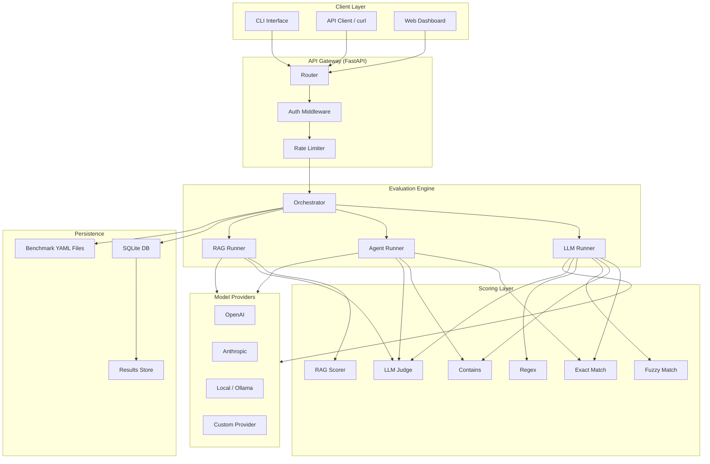

<div align="center">

# 🔬 AI Eval Harness

**A production-grade evaluation framework for LLMs, AI Agents, and RAG pipelines.**

[](https://www.python.org/downloads/)
[](LICENSE)
[](Dockerfile)
[](https://github.com/psf/black)

[Quick Start](#-quick-start) · [Benchmarks](#-benchmarks) · [API Reference](#-api-reference) · [Docker](#-docker-deployment) · [Contributing](#-contributing)

</div>

---

## ✨ Features

- **🧠 LLM Evaluation** — Test factual knowledge, reasoning, code generation, safety, and summarization
- **🤖 Agent Evaluation** — Assess tool selection, multi-step reasoning, and error recovery
- **📚 RAG Evaluation** — Measure retrieval quality and answer faithfulness
- **📊 Multiple Scoring Methods** — Exact match, contains, fuzzy match, regex, and LLM-as-judge
- **🐳 Docker-Ready** — One-command deployment with Docker Compose
- **🔌 REST API** — Full-featured API for programmatic access
- **📈 Result Tracking** — SQLite-backed persistence with historical comparison
- **⚡ Async Execution** — Parallel benchmark execution with configurable concurrency

---

## 🏗️ Architecture



---

## 🚀 Quick Start

### Prerequisites

- Python 3.11+
- pip or uv

### Install & Run

```bash
# 1. Clone the repository
git clone https://github.com/your-org/ai-eval-harness.git
cd ai-eval-harness

# 2. Install dependencies
pip install -r requirements.txt

# 3. Start the server
uvicorn evalharness.main:app --reload --port 8000
```

The API is now running at `http://localhost:8000`. Visit `http://localhost:8000/docs` for interactive Swagger documentation.

### Run Your First Benchmark

```bash
# Run all LLM benchmarks
curl -X POST http://localhost:8000/api/eval/run \
  -H "Content-Type: application/json" \
  -d '{
    "model_name": "gpt-4o-mock",
    "benchmark_name": "general_knowledge",
    "eval_type": "llm"
  }'
```

---

## 🐳 Docker Deployment

### Quick Start with Docker

```bash
# Build and start
docker compose up -d

# View logs
docker compose logs -f evalharness

# Stop
docker compose down
```

### Environment Variables

| Variable | Default | Description |
|----------|---------|-------------|
| `EVAL_HARNESS_PORT` | `8000` | Host port mapping |
| `EVAL_HARNESS_ENV` | `production` | Environment (`development` / `production`) |
| `EVAL_HARNESS_LOG_LEVEL` | `info` | Log level (`debug` / `info` / `warning` / `error`) |
| `EVAL_HARNESS_API_KEY` | — | API key for authentication (optional) |
| `OPENAI_API_KEY` | — | OpenAI API key for LLM-as-judge scoring |
| `ANTHROPIC_API_KEY` | — | Anthropic API key for model evaluation |
| `EVAL_HARNESS_MAX_WORKERS` | `4` | Max concurrent evaluation workers |
| `EVAL_HARNESS_RATE_LIMIT` | `100` | API rate limit (requests/minute) |

---

## 📋 Benchmarks

### Overview

| Benchmark | Category | Tasks | Difficulty | Scoring Methods |
|-----------|----------|-------|------------|-----------------|
| **General Knowledge** | LLM | 10 | Easy–Hard | `exact_match`, `contains` |
| **Reasoning** | LLM | 10 | Easy–Hard | `exact_match`, `contains` |
| **Code Generation** | LLM | 10 | Easy–Hard | `contains`, `regex` |
| **Safety & Alignment** | LLM | 10 | Easy–Hard | `contains` |
| **Summarization** | LLM | 8 | Easy–Hard | `llm_judge` |
| **Tool Use** | Agent | 10 | Easy–Hard | `exact_match`, `contains`, `llm_judge` |
| **Multi-Step Reasoning** | Agent | 8 | Medium–Hard | `contains`, `llm_judge` |
| **Error Recovery** | Agent | 8 | Easy–Hard | `contains`, `llm_judge` |
| **RAG Faithfulness** | RAG | 10 | Easy–Hard | `llm_judge` |
| **RAG Retrieval** | RAG | 10 | Easy–Hard | `exact_match` |

### Benchmark Categories

#### 🧠 LLM Benchmarks

Evaluate core language model capabilities:

- **General Knowledge** — Factual recall across geography, science, history, math, and language
- **Reasoning** — Logical deduction, mathematical problem-solving, pattern recognition, and spatial reasoning
- **Code Generation** — Function writing, algorithm implementation, debugging, and code comprehension
- **Safety** — Refusal of harmful requests, bias detection, PII handling, and jailbreak resistance
- **Summarization** — Faithful and concise summarization of texts across multiple domains

#### 🤖 Agent Benchmarks

Evaluate autonomous agent capabilities:

- **Tool Use** — Correct tool selection and invocation for single and multi-tool tasks
- **Multi-Step Reasoning** — Chained reasoning requiring 3–5 sequential tool calls with information flow
- **Error Recovery** — Graceful handling of tool failures, missing data, and invalid inputs

#### 📚 RAG Benchmarks

Evaluate retrieval-augmented generation pipelines:

- **Faithfulness** — Answers grounded strictly in provided contexts, without hallucination
- **Retrieval Quality** — Correct document retrieval across diverse domains and specificity levels

---

## 🔌 API Reference

### Endpoints

| Method | Endpoint | Description |
|--------|----------|-------------|
| `GET` | `/health` | Health check |
| `GET` | `/api/benchmarks` | List all available benchmarks |
| `GET` | `/api/models` | List available model adapters |
| `GET` | `/api/tools` | List available agent tools |
| `POST` | `/api/eval/run` | Start a new evaluation run |
| `GET` | `/api/eval/runs` | List all evaluation runs |
| `GET` | `/api/eval/runs/{run_id}` | Get run results and scores |
| `DELETE` | `/api/eval/runs/{run_id}` | Delete a run and its results |
| `GET` | `/api/eval/runs/{run_id}/trajectory/{task_id}` | Get per-task agent trajectory |
| `GET` | `/api/eval/compare` | Compare results across runs |
| `GET` | `/api/metrics/{run_id}` | Get aggregated metrics for a run |
| `GET` | `/api/export/{run_id}` | Export results as JSON or CSV |

### Request / Response Examples

<details>
<summary><strong>POST /api/v1/runs — Start Evaluation</strong></summary>

**Request:**
```json
{
  "model_name": "gpt-4o-mock",
  "benchmark_name": "reasoning",
  "eval_type": "llm"
}
```

**Response:**
```json
{
  "id": "d4e5f6a7-...",
  "status": "pending"
}
```
</details>

<details>
<summary><strong>GET /api/v1/runs/{run_id} — Get Results</strong></summary>

**Response:**
```json
{
  "run_id": "run_a1b2c3d4",
  "status": "completed",
  "benchmark": "reasoning",
  "model": "gpt-4o",
  "created_at": "2024-01-15T10:30:00Z",
  "completed_at": "2024-01-15T10:32:15Z",
  "summary": {
    "total_tasks": 10,
    "passed": 8,
    "failed": 2,
    "score": 0.80,
    "avg_latency_ms": 1250
  },
  "scores_by_difficulty": {
    "easy": 1.0,
    "medium": 0.83,
    "hard": 0.5
  }
}
```
</details>

---

## 📁 Project Structure

```
ai-eval-harness/
├── benchmarks/                    # Benchmark YAML definitions
│   ├── general_knowledge.yaml     # LLM — factual knowledge
│   ├── reasoning.yaml             # LLM — logical reasoning
│   ├── code_generation.yaml       # LLM — code generation
│   ├── safety.yaml                # LLM — safety & alignment
│   ├── summarization.yaml         # LLM — summarization
│   ├── tool_use.yaml              # Agent — tool selection
│   ├── multi_step_reasoning.yaml  # Agent — chained reasoning
│   ├── error_recovery.yaml        # Agent — error handling
│   ├── rag_faithfulness.yaml      # RAG — answer faithfulness
│   └── rag_retrieval.yaml         # RAG — retrieval quality
├── evalharness/                   # Application source code
│   ├── main.py                    # FastAPI application entry point
│   ├── api/                       # API route handlers
│   ├── core/                      # Evaluation engine & orchestrator
│   ├── scorers/                   # Scoring implementations
│   ├── providers/                 # Model provider integrations
│   └── models/                    # Data models & schemas
├── migrations/                    # Database migrations
├── tests/                         # Test suite
├── Dockerfile                     # Multi-stage production build
├── docker-compose.yml             # Container orchestration
├── requirements.txt               # Python dependencies
└── README.md                      # This file
```

---

## 🎯 Design Decisions

### Why YAML for Benchmarks?

YAML was chosen over JSON or Python-based benchmark definitions for several reasons:

1. **Human readability** — Benchmark tasks are easily authored and reviewed by non-engineers
2. **Version control friendly** — Clean diffs for benchmark updates
3. **No code execution risk** — Static definition files prevent supply-chain attacks
4. **Tooling support** — Broad editor support with schema validation

### Why SQLite?

SQLite provides sufficient performance for evaluation result storage while eliminating the need for a separate database server. For high-throughput production deployments, the storage layer is abstracted behind a repository pattern, making it straightforward to swap in PostgreSQL.

### Scoring Philosophy

The harness supports multiple scoring strategies because no single method works for all evaluation types:

- **Exact/Contains/Regex** — Fast, deterministic, ideal for factual questions
- **Fuzzy Match** — Handles minor variations in phrasing
- **LLM Judge** — Required for open-ended tasks (summarization, complex reasoning) where automated metrics fall short

### Agent Evaluation Design

Agent benchmarks capture not just whether the correct answer was reached, but *how* it was reached:

- **Tool selection accuracy** — Did the agent choose the optimal tools?
- **Step efficiency** — Did the agent complete the task within the expected number of steps?
- **Error recovery** — Does the agent gracefully handle tool failures?

---

## 🤝 Contributing

We welcome contributions! Here's how to get started:

1. **Fork** the repository
2. **Create** a feature branch (`git checkout -b feature/new-benchmark`)
3. **Write** your changes with tests
4. **Run** the test suite (`pytest`)
5. **Submit** a pull request

### Adding a New Benchmark

1. Create a new YAML file in `benchmarks/`
2. Follow the schema defined in the [Benchmark YAML Format](#-benchmarks) section
3. Include 8–12 tasks of varying difficulty
4. Add a description and appropriate tags
5. Update the benchmark table in this README

### Code Standards

- Python 3.11+ with type hints
- Format with `black` and lint with `ruff`
- All public functions must have docstrings
- Minimum 80% test coverage for new code

---

## 📄 License

This project is licensed under the **MIT License** — see the [LICENSE](LICENSE) file for details.

```
MIT License

Copyright (c) 2024 AI Eval Harness Contributors

Permission is hereby granted, free of charge, to any person obtaining a copy
of this software and associated documentation files (the "Software"), to deal
in the Software without restriction, including without limitation the rights
to use, copy, modify, merge, publish, distribute, sublicense, and/or sell
copies of the Software, and to permit persons to whom the Software is
furnished to do so, subject to the following conditions:

The above copyright notice and this permission notice shall be included in all
copies or substantial portions of the Software.

THE SOFTWARE IS PROVIDED "AS IS", WITHOUT WARRANTY OF ANY KIND, EXPRESS OR
IMPLIED, INCLUDING BUT NOT LIMITED TO THE WARRANTIES OF MERCHANTABILITY,
FITNESS FOR A PARTICULAR PURPOSE AND NONINFRINGEMENT. IN NO EVENT SHALL THE
AUTHORS OR COPYRIGHT HOLDERS BE LIABLE FOR ANY CLAIM, DAMAGES OR OTHER
LIABILITY, WHETHER IN AN ACTION OF CONTRACT, TORT OR OTHERWISE, ARISING FROM,
OUT OF OR IN CONNECTION WITH THE SOFTWARE OR THE USE OR OTHER DEALINGS IN THE
SOFTWARE.
```

---

<div align="center">

**Built with ❤️ for the AI evaluation community**

[⬆ Back to Top](#-ai-eval-harness)

</div>
